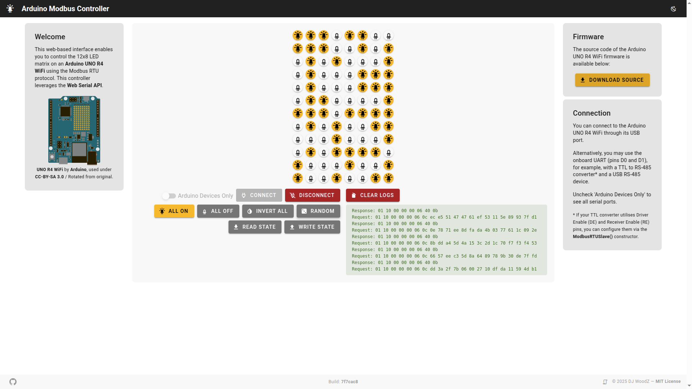

# Arduino Modbus Controller

A web-based interface that enables you to control the 12x8 LED matrix on an Arduino UNO R4 using the Modbus RTU protocol. This controller leverages the Web Serial API.

| Light Theme | Dark Theme |
| --- | --- |
| [](./screenshots/light-theme.png) | [](./screenshots/dark-theme.png) |


## 💿 Install

Set up your project using your preferred package manager. Use the corresponding command to install the dependencies:

### NPM Example

```bash
npm install
```

## 💡 Usage

How to start the development server and build your project for production:

### Starting the Development Server

To start the development server with hot-reload, run the `dev` command. The server will be accessible at [http://localhost:3000](http://localhost:3000):

#### NPM Example

```bash
npm run dev
```

### Building for Production

To build your project for production, use:

#### NPM Example

```bash
npm run build
```

## 📑 License

[MIT](https://github.com/DJWoodZ/Arduino-Modbus-Controller/blob/main/LICENSE)

Copyright (c) 2025 DJ WoodZ
